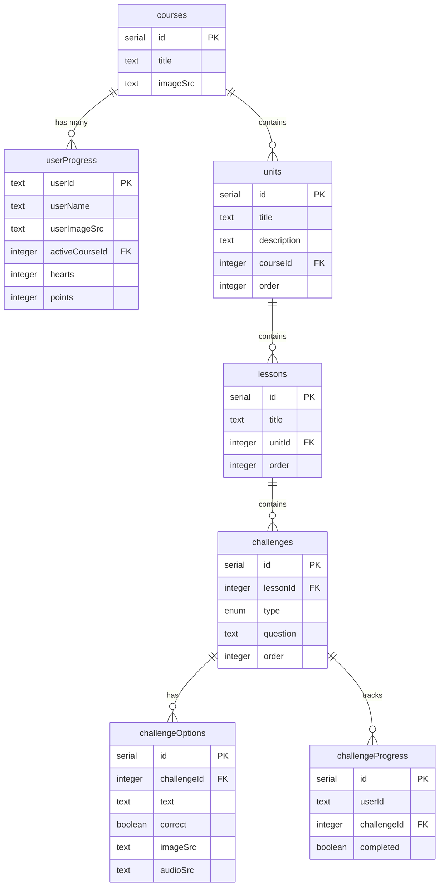

# Learning Platform Database Schema Documentation

## Overview

This document outlines the database schema for a learning platform implemented using Drizzle ORM with PostgreSQL. The schema supports courses, units, lessons, challenges, and user progress tracking.

## Schema Diagram



## Table Definitions

### `courses`

The top-level entity representing a learning course.

| Column   | Type   | Constraints | Description         |
| -------- | ------ | ----------- | ------------------- |
| id       | serial | PRIMARY KEY | Unique identifier   |
| title    | text   | NOT NULL    | Course title        |
| imageSrc | text   | NOT NULL    | URL to course image |

**Relations:**

- One-to-many with `userProgress`
- One-to-many with `units`

### `units`

Organizational blocks within a course.

| Column      | Type    | Constraints  | Description                 |
| ----------- | ------- | ------------ | --------------------------- |
| id          | serial  | PRIMARY KEY  | Unique identifier           |
| title       | text    | NOT NULL     | Unit title                  |
| description | text    | NOT NULL     | Unit description            |
| courseId    | integer | NOT NULL, FK | Reference to parent course  |
| order       | integer | NOT NULL     | Display order within course |

**Relations:**

- Many-to-one with `courses`
- One-to-many with `lessons`

**Cascade Behavior:**

- Deleted when parent course is deleted

### `lessons`

Individual learning sessions within a unit.

| Column | Type    | Constraints  | Description               |
| ------ | ------- | ------------ | ------------------------- |
| id     | serial  | PRIMARY KEY  | Unique identifier         |
| title  | text    | NOT NULL     | Lesson title              |
| unitId | integer | NOT NULL, FK | Reference to parent unit  |
| order  | integer | NOT NULL     | Display order within unit |

**Relations:**

- Many-to-one with `units`
- One-to-many with `challenges`

**Cascade Behavior:**

- Deleted when parent unit is deleted

### `challenges`

Learning exercises within lessons.

| Column   | Type    | Constraints  | Description                 |
| -------- | ------- | ------------ | --------------------------- |
| id       | serial  | PRIMARY KEY  | Unique identifier           |
| lessonId | integer | NOT NULL, FK | Reference to parent lesson  |
| type     | enum    | NOT NULL     | Either 'SELECT' or 'ASSIST' |
| question | text    | NOT NULL     | Challenge question          |
| order    | integer | NOT NULL     | Display order within lesson |

**Relations:**

- Many-to-one with `lessons`
- One-to-many with `challengeOptions`
- One-to-many with `challengeProgress`

**Cascade Behavior:**

- Deleted when parent lesson is deleted

### `challengeOptions`

Possible answers for challenges.

| Column      | Type    | Constraints  | Description                        |
| ----------- | ------- | ------------ | ---------------------------------- |
| id          | serial  | PRIMARY KEY  | Unique identifier                  |
| challengeId | integer | NOT NULL, FK | Reference to parent challenge      |
| text        | text    | NOT NULL     | Option text                        |
| correct     | boolean | NOT NULL     | Whether this is the correct answer |
| imageSrc    | text    | NULLABLE     | Optional image URL                 |
| audioSrc    | text    | NULLABLE     | Optional audio URL                 |

**Relations:**

- Many-to-one with `challenges`

**Cascade Behavior:**

- Deleted when parent challenge is deleted

### `challengeProgress`

Tracks user progress through challenges.

| Column      | Type    | Constraints             | Description            |
| ----------- | ------- | ----------------------- | ---------------------- |
| id          | serial  | PRIMARY KEY             | Unique identifier      |
| userId      | text    | NOT NULL                | User identifier        |
| challengeId | integer | NOT NULL, FK            | Reference to challenge |
| completed   | boolean | NOT NULL, DEFAULT false | Completion status      |

**Relations:**

- Many-to-one with `challenges`

**Cascade Behavior:**

- Deleted when parent challenge is deleted

### `userProgress`

Tracks overall user progress and status.

| Column         | Type    | Constraints                      | Description             |
| -------------- | ------- | -------------------------------- | ----------------------- |
| userId         | text    | PRIMARY KEY                      | User identifier         |
| userName       | text    | NOT NULL, DEFAULT 'User'         | Display name            |
| userImageSrc   | text    | NOT NULL, DEFAULT '/mascort.svg' | Avatar image URL        |
| activeCourseId | integer | FK                               | Currently active course |
| hearts         | integer | NOT NULL, DEFAULT 5              | Lives remaining         |
| points         | integer | NOT NULL, DEFAULT 0              | Achievement points      |

**Relations:**

- Many-to-one with `courses` (active course)

**Cascade Behavior:**

- Active course reference nullified when referenced course is deleted

## Enums

### `challengesEnum`

Type: `type`
Values:

- `SELECT`: Multiple choice question
- `ASSIST`: Assisted learning question

## Design Considerations

1. **Ordering System:**

   - All hierarchical entities (units, lessons, challenges) include an `order` field for explicit sequencing
   - This allows for flexible reordering without depending on creation timestamps or IDs

2. **Cascade Deletion:**

   - Implemented throughout the schema to maintain referential integrity
   - Deleting a parent record automatically removes all dependent records

3. **Default Values:**

   - User progress starts with 5 hearts and 0 points
   - New users get a default name and avatar
   - Challenge completion defaults to false

4. **Multimedia Support:**
   - Courses and users have associated images
   - Challenge options can include both images and audio
   - All media is referenced via URLs/paths

## Querying Best Practices

1. Always use the established relations when querying related data:

```typescript
const coursesWithUnits = await db.query.courses.findMany({
  with: {
    units: true,
  },
});
```

2. Respect the `order` field when retrieving hierarchical data:

```typescript
const orderedLessons = await db.query.lessons.findMany({
  orderBy: (lessons, { asc }) => [asc(lessons.order)],
});
```

3. Use the type enum when creating new challenges:

```typescript
await db.insert(challenges).values({
  type: 'SELECT', // or 'ASSIST'
  // ... other fields
});
```
